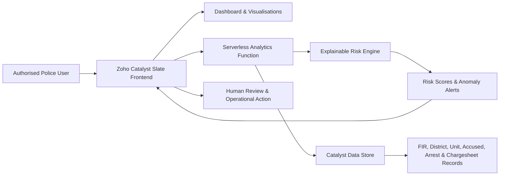

ye dekh bhai aab bta kya samaj aaya aur kya karna hai 
KSP Datathon 2026 _ Prototype Submission Template (1).pptx
Presentation
bhai is templet ke according ise photto , templet and is format mai information deni hai same format and design use karke final project ki ppt banaygi 
bhai ye aa rha hai is page par aab muje ek bat bta mai aage kya karu and ye jo niche links aa rhe hai quick links ye kya hai inka kya karu mai aur ye free redeem kya de rhe hai vo bnta 
bhai aab bta mai isme kya karu 
bhai aab bta kya karu
Police_FIR_ER_Diagram.pdf
PDF
ye le bhai dekh le 
Worked for 58s

Tanishk Boss, maine poora 9-page Police FIR ER document analyse kar liya. Ye raw crime dataset nahi hai; ye database ka complete blueprint hai. Iske basis par ab hum project confidently lock kar sakte hain.

Final project: KAVACH 360
AI-Assisted FIR Intelligence & Case Lifecycle Command Center

Karnataka Police ke FIR records ko district, police station, crime category, case status, accused, arrest aur chargesheet data se connect karke ek unified operational dashboard banana.

Ye project is schema ke liye perfect kyun hai?

CaseMaster table me FIR number, registration date, police station, category, offence gravity, major/minor crime head, case status aur court ki information hai. Incident timing, latitude-longitude aur brief facts bhi available hain, isliye maps, filters aur detailed case analytics ban sakte hain.

Ek FIR ke multiple victims, accused persons, arrest events, complainants aur legal act-sections ho sakte hain. Isi relationship structure se hum Case 360 View aur criminal connection graph bana sakte hain.

Arrest table me arrest/surrender date, district, police station, investigating officer, court aur accused mapping hai. Chargesheet table me chargesheet date, final report type aur responsible officer diya hai. Isse arrest delay, chargesheet turnaround aur pending-case analytics possible hai.

District, police unit, employee, rank aur designation hierarchy available hai, isliye state → district → police station → officer drilldown ban sakta hai.

Prototype ke final modules
1. Command Dashboard
Total FIRs
Active/pending cases
Heinous offences
Arrest rate
Chargesheet rate
Average investigation duration
High-risk districts
Recent anomaly alerts
2. Crime Hotspot Map

Latitude-longitude ke through Karnataka map par:

Crime clusters
District risk level
Major/minor crime category
Day/night filter
Heinous/non-heinous filter
Time-range filter
Police-station drilldown
3. Case Lifecycle Analytics
FIR Registered
      ↓
Investigation
      ↓
Arrest / Surrender
      ↓
Chargesheet / Final Report
      ↓
Court / Closure

Dashboard dikhayega:

Kitne cases investigation me hain
Kaunse cases unusually delayed hain
FIR-to-arrest duration
FIR-to-chargesheet duration
Undetected aur false-case reports
Station-wise pendency
4. Repeat-Accused Intelligence
Ek accused kitne FIRs me linked hai
Co-accused network
Associated crime categories
Arrest history
Related police stations/districts
Repeat-offender indicator

Important: System kisi person ko automatically guilty declare nahi karega. Ye sirf existing case relationships ko operational review ke liye highlight karega.

5. Explainable Risk and Anomaly Alerts

Risk score demographic information par nahi hoga. Isme objective factors use honge:

Recent crime-frequency increase
Heinous offences
Unresolved-case volume
Repeat accused activity
Night-time incidents
Historical hotspot pattern

Har alert ke saath explanation:

High risk because robbery incidents increased 34%, three heinous offences were registered and unresolved-case volume is above the district average.

6. Police Station and Officer Workload
Cases assigned per officer
Pending investigations
Arrests completed
Chargesheets submitted
Average disposal duration
Overloaded police stations

Iska objective employee ranking karna nahi, balki resource allocation improve karna hoga.

7. Case 360 View

Ek FIR open karne par:

Crime and registration details
Incident location
Victims
Accused
Arrest events
Applicable acts and sections
Investigating officer
Case status
Chargesheet details
Timeline
Dataset strategy

Document me actual records nahi hain, isliye hum synthetic and anonymised prototype dataset banayenge:

Approximately 800 FIR records
12 Karnataka districts
30 police stations
60 police employees
200 anonymised accused records
Arrest and chargesheet records
Crime categories and gravity levels
Realistic but fictional coordinates and dates

Crime number document ke given structured format ke according generate kiya jayega.

PPT, README aur application me clearly likhenge:

“The prototype uses synthetic and anonymised data generated according to the official Police FIR database schema. No real citizen or operational police data is included.”

Sensitive fields ka kya karenge?

Schema me caste, religion, names aur personal information bhi hai, lekin hum:

Caste/religion ko dashboard ya risk model me use nahi karenge
Real names use nahi karenge
Brief facts ko redacted rakhenge
Victim identity hide karenge
Accused ke synthetic IDs use karenge
Role-based access propose karenge

Document par Karnataka Police Department | Confidential likha hai, isliye original PDF ko public GitHub repository me upload nahi karna. Hum apna simplified architecture diagram khud banayenge.

Prototype ke liye required database tables

Saare tables recreate karne ki zarurat nahi. Working version me ye core tables enough hain:

CaseMaster
Occurrence
District
Unit
Employee
CrimeHead
CrimeSubHead
CaseStatusMaster
GravityOffence
Accused
ArrestSurrender
ChargesheetDetails
Act
Section
ActSectionAssociation

Schema me incident fields CaseMaster continuation me dikhte hain, lekin relationship matrix ek separate one-to-one Inv_OccuranceTime table mention karti hai. Prototype me hum ise clean karke separate Occurrence table rakhenge.

Catalyst architecture
Police Officer / Administrator
               ↓
Catalyst Web Client Hosting
               ↓
Catalyst Serverless Functions
       ↙                     ↘
Catalyst Data Store      Analytics Engine
               ↓
Dashboard, Alerts and Case 360
Catalyst services
Web Client Hosting / Slate: Dashboard deployment
Data Store: FIR relational database
Serverless Functions: APIs, filtering, risk scoring and anomaly logic
Authentication: Officer/admin login, time mila to
SmartBrowz: PDF operational report, optional
Zia AutoML: Future enhancement or prototype extension after sufficient training data

Zia AutoML ko bas PPT me fake implemented nahi likhenge. Use tabhi “implemented” bolenge jab actual working integration complete hogi.

PPT ke liye final problem statement

Police FIR information is distributed across interconnected case, accused, victim, arrest, legal, geographical and administrative records. The absence of a unified analytical interface makes it difficult to identify crime trends, investigation delays, repeat-accused connections, high-risk locations and operational workload. KAVACH 360 transforms the relational FIR ecosystem into an explainable, privacy-aware intelligence and case-lifecycle command centre.

One-line USP

From fragmented FIR records to explainable, location-aware and actionable police intelligence on a unified Catalyst-powered platform.

Ab Catalyst me project ka naam Kavach360 create kar aur project dashboard ka screenshot bhej. Wahan se hum actual database aur prototype build start karenge.

Zoho Credits Claiming1.mp4
File
bhai ye ek video bhi thi usme steps wli ye bhi dekh le ek bar jaldi se aur iske according jo karna tha vo karwa de 
bhai ye challenges hai hame kisi ek challenge par choose karna hai aur above data and requiremt ke according kam karna hai aab bta hum aage kya kare konsa choose kare kiske winning  ke chances zyada hai and kis par project acha bane ga 
Today 11:36 PM
bhai aab kya karu
bhai ye aa gya hai aab bta aage kya karu 
bhai ye page aaya hai aab aage bta mai kya karu 
bhai ye aa rha hai aab mai kese karu aage ye bta 
bhai mai isme kya bharu 
bhai aab kya karu
bhai ye aa rha hai copy paste karne ke bad aab iske aage bta mai kya karu ache se bta step by step
bhai ye wla tab to galti se band ho gya hai muj se kavach360-zfjpgwhy.onslate.in tab and aab website par ye aa rha hai aab aage bta mai kya karu
bhai ye aa gya hai aab kya karu aage bta 
bhai ye aa rha hai aab bta mai kavach wla part kese karu kha jau step by step
bhai preview par click karke ye aa rha hai aab kya karu mai aage ye bta 
bhai agar mai is link ko new tab par khol rha hu to ye aa rha hai website nhi khul rhi yarr aab kya karu https://kavach360-rgvbqglj.onslate.in/ dekh aur bta 
bhai ye hua hai abhi tak aab aage bta mai kya karu aur kese 

Bhai upload sahi direction me ho raha hai, bas commit karne se pehle 2 galat items hata de.

Step 1: Ye 2 files remove kar

Screenshot me inke right side × par click kar:

KAVACH360_Prototype_v1.zip
download

ZIP ko GitHub repo ke andar rakhne ki zarurat nahi hai, aur download bhi unwanted file lag rahi hai.

Baaki files ko mat hatana, especially:

README.md
catalyst.json
DEPLOY_CHECKLIST.txt
NOTICE.md
OPEN_KAVACH360.bat
index.html
app.js
client-package.json
datastore_schema.md
architecture.svg
index.js
Step 2: Upload complete hone do

List ke saare files ke upload hone tak wait kar. Koi loading/progress indicator chal raha ho to commit button turant mat dabana.

Step 3: Page ke bilkul neeche jao

Mouse wheel se neeche scroll karo. Wahan Commit changes section milega.

Commit message me likho:

Initial KAVACH 360 Datathon prototype

Description optional ho to likh sakta hai:

Added working frontend, Catalyst deployment files, analytics function, documentation and architecture diagrams.
Step 4: Main branch par commit karo

Agar options dikhte hain to:

Commit directly to the main branch

selected rehne do.

Phir green/blue:

Commit changes

button par click kar.

Step 5: Repository open hone ke baad

Commit complete hone par repository homepage khulega. Wahan check karna:

README.md neeche automatically display ho
Files list me client, functions, data, docs, submission folders dikh rahe hon
Repository ke naam ke paas Public likha ho

Abhi pehle ZIP aur download ko × se hata → neeche scroll → Commit changes kar.

 bhai ye thik hai kya aur aab age kese karu

Haan bhai, commit message aur description bilkul theek hai.

Ab ye karo:

Green Commit changes button par click karo.
Upload complete hone tak page ko refresh ya close mat karna.
Repository ka main page khulne par check karo:
Repository ke paas Public likha ho.
README.md neeche visible ho.
client, functions, data, docs, submission folders dikh rahe hon.

Agar folders ki jagah saari files root par alag-alag dikhengi, tab bhi panic mat karna—screenshot bhejna, structure correct karwa denge.

Commit successful hone ke baad repository ka URL kuch aisa hoga:

https://github.com/tanishkgupta365/KAVACH360

Ab green Commit changes dabao aur repository page ka screenshot bhejo.

bhai iska readme change karwa de acha nhi lag rha acha lengthy attractive and professional sa de de aur phir aage bta mai kya karu 

Haan bhai, current README.md me galti se batch-file wala content chala gaya hai. Maine complete lengthy, attractive aur professional README ready kar diya hai—live deployment link, features, architecture, Catalyst services, privacy, setup, future scope aur benefits sab included hain.

README_KAVACH360.md

GitHub par README replace karne ke steps
1. GitHub repository me README.md par click karo

Tere repo ke files me:

README.md

open karo.

2. Edit button dabao

README open hone ke baad top-right me pencil icon ✏️ / Edit this file par click karo.

3. Purana content delete karo

Editor ke andar click karke:

Ctrl + A

phir:

Backspace

Purana batch-file content delete ho jayega.

4. Naya README copy karo
Upar diya hua README download karo.
Downloaded README_KAVACH360.md par right-click karo.
Open with → Notepad select karo.
Notepad me:
Ctrl + A
Ctrl + C
5. GitHub editor me paste karo

GitHub ke blank README editor me:

Ctrl + V

Ab professional README ka poora content aa jayega.

6. Commit karo

Page ke neeche Commit changes par click karo.

Commit message:

Add professional KAVACH 360 project documentation

Phir:

Commit directly to the main branch selected rehne do.
Green Commit changes button dabao.
Uske baad ek chhota improvement

Repository ke right side About section me gear icon ⚙️ click karke:

Website:

https://kavach360-rgvbqglj.onslate.in/

Topics:

crime-analytics
data-visualization
zoho-catalyst
hackathon
public-safety
javascript
data-analytics

README update hone ke baad repository homepage refresh karna. Uske next phase me 3-minute demo video record karke public link banana hai, phir official template PPT complete karenge. 

Library
/
README_KAVACH360.md
<div align="center">

# 🛡️ KAVACH 360

### AI-Driven Crime Analytics & Visualization Platform  
**KSP Datathon 2026 Prototype**

[](https://kavach360-rgvbqglj.onslate.in/)
[](#)
[](#)
[](#)

**Transforming fragmented FIR records into explainable, location-aware and actionable policing intelligence.**

[🚀 Open Live Prototype](https://kavach360-rgvbqglj.onslate.in/) ·
[📁 View Repository](https://github.com/tanishkgupta365/KAVACH360)

</div>

---

## 📌 Overview

**KAVACH 360** is a privacy-aware crime analytics and visualisation platform designed for the **AI-Driven Crime Analytics & Visualization Platform** challenge of **KSP Datathon 2026**.

Police FIR data is usually distributed across multiple connected records such as cases, districts, police stations, crime categories, accused persons, arrests, chargesheets, legal sections and case-status information. KAVACH 360 converts these fragmented relationships into a unified operational command center that helps authorised users identify crime hotspots, delayed investigations, high-risk districts, repeat-accused associations and police-station workload.

The prototype is deployed on **Zoho Catalyst Slate** and uses deterministic synthetic and anonymised data structured according to the supplied FIR database design. No real citizen or confidential police operational data is included.

---

## 🎯 Problem Statement

Police teams need to analyse large and interconnected FIR records quickly. Traditional tables and disconnected reports make it difficult to:

- Detect emerging crime hotspots and district-level trends
- Identify delayed investigations and unresolved case backlogs
- Track FIR-to-arrest-to-chargesheet progression
- Discover repeat-accused and co-accused relationships
- Compare police-station workload and operational pressure
- Convert raw case records into explainable decision support

KAVACH 360 addresses this gap through one interactive and explainable visual intelligence platform.

---

## 💡 Proposed Solution

KAVACH 360 combines geospatial analytics, case-lifecycle monitoring, relationship visualisation, intent-based search and explainable risk scoring into a single dashboard.

The system supports human decision-making by showing **why** a district or case receives a higher risk score. It does not autonomously declare guilt or recommend enforcement action without authorised human review.

---

## ✨ Key Features

### 1. Crime Intelligence Command Center
- Total FIRs
- Active and pending cases
- Heinous-offence count
- Arrest and chargesheet rates
- Average disposal time
- District risk ranking
- Live anomaly alerts

### 2. Karnataka Hotspot Map
- District-level crime visualisation
- Risk and volume modes
- High/medium/low risk indicators
- Station-level workload drilldown
- Preventive action recommendations

### 3. Explainable Risk Engine
Risk scores are generated using operational indicators such as:

- Recent crime velocity
- Heinous-offence share
- Unresolved case volume
- Repeat-accused activity
- Historical hotspot frequency

Every score is accompanied by contributing factors for transparency.

### 4. Case Lifecycle Analytics
Tracks cases through:

```text
FIR Registration → Investigation → Arrest/Surrender → Chargesheet → Closure
```

It highlights investigation delays, pending cases and SLA exceptions.

### 5. Repeat-Accused Network
- Accused-to-FIR relationships
- Co-accused associations
- Repeat-appearance indicators
- Related districts and crime categories
- Human-review safeguards

### 6. Case 360 Explorer
A unified case view containing:

- Crime number and registration date
- District and police station
- Crime category and gravity
- Current status
- Incident location
- Legal sections
- Investigating officer reference
- Arrest and chargesheet timeline
- Protected victim information
- Explainable case-risk score

### 7. Ask KAVACH
An intent-based operational search interface supporting queries such as:

```text
Show high-risk districts
Open delayed cases
Robbery in Bengaluru
Show repeat-accused network
```

### 8. Exportable Operational Brief
Users can download a structured intelligence brief containing filtered metrics, priority districts and risk indicators.

---

## 🧠 System Architecture



---

## 🛠️ Technology Stack

| Layer | Technology |
|---|---|
| Frontend | HTML5, CSS3, JavaScript |
| Visualisation | SVG, Canvas |
| Hosting | Zoho Catalyst Slate |
| Backend Scaffold | Catalyst Serverless Advanced I/O Function |
| Database Design | Catalyst Data Store relational schema |
| Version Control | GitHub |
| Data | Synthetic and anonymised FIR records |

---

## ☁️ Zoho Catalyst Services

| Catalyst Service | Role in Solution |
|---|---|
| Slate | Frontend hosting and deployment |
| Serverless Functions | Risk-scoring and analytics API scaffold |
| Data Store | Relational FIR data architecture |
| Authentication | Proposed role-based access for production |
| SmartBrowz | Proposed PDF/report generation |
| API Gateway | Proposed protected API access |

---

## 🔐 Privacy, Ethics & Responsible AI

KAVACH 360 follows a privacy-first design:

- No real citizen or police operational data is used
- Names are replaced with synthetic reference IDs
- Victim identity is protected
- Caste and religion are not used in risk scoring
- The platform does not infer guilt
- Risk outputs are explainable
- Human review is mandatory before operational action
- Role-based access and audit logs are recommended for production

---

## 📊 Prototype Dataset

The working prototype contains approximately **680 deterministic synthetic FIR records** distributed across Karnataka districts and police stations.

The generated records include:

- FIR registration dates
- District and station details
- Crime categories
- Gravity levels
- Case statuses
- Coordinates
- Accused reference IDs
- Arrest indicators
- Chargesheet indicators
- Legal sections
- Risk factors

> **Disclaimer:** The prototype data is fictional and anonymised. It is created only for demonstration and evaluation.

---

## 📂 Repository Structure

```text
KAVACH360/
├── index.html                 # Main application interface
├── styles.css                 # Professional command-center UI
├── app.js                     # Analytics, charts, filters and interactions
├── client-package.json        # Catalyst Slate client configuration
├── index.js                   # Serverless analytics API scaffold
├── package.json               # Backend dependencies
├── catalyst-config.json       # Catalyst function configuration
├── catalyst.json              # Catalyst project configuration
├── datastore_schema.md        # Simplified relational schema
├── architecture.svg           # Architecture diagram
├── process_flow.svg           # Process-flow diagram
├── prototype_brief.md         # Submission-ready project brief
├── DEPLOY_CHECKLIST.txt       # Deployment and submission checklist
├── OPEN_KAVACH360.bat         # Windows local launcher
├── NOTICE.md                  # Data and confidentiality notice
└── README.md
```

---

## ▶️ Run Locally

### Method 1: Directly open the application

Open:

```text
index.html
```

### Method 2: Use a local Python server

```bash
python -m http.server 8080
```

Then open:

```text
http://localhost:8080
```

### Windows shortcut

Double-click:

```text
OPEN_KAVACH360.bat
```

---

## 🚀 Live Deployment

The prototype is deployed exclusively using **Zoho Catalyst Slate**, as required by the hackathon.

**Live URL:**  
https://kavach360-rgvbqglj.onslate.in/

---

## 🎬 Recommended Demo Flow

1. Introduce the policing-data problem
2. Show the Command Center KPIs
3. Apply district and crime-category filters
4. Open the Karnataka Hotspot Map
5. Explain the district risk score
6. Show the Case Lifecycle module
7. Open delayed-case exceptions
8. Explore the Repeat-Accused Network
9. Open a Case 360 record
10. Ask: `robbery in Bengaluru`
11. Export the operational brief
12. Close with privacy and future-scope highlights

---

## 📈 Expected Impact

KAVACH 360 can help authorised police leadership:

- Improve situational awareness
- Detect emerging hotspots earlier
- Prioritise unresolved and delayed investigations
- Allocate patrol and investigation resources effectively
- Compare station and district workload
- Explore recorded case relationships faster
- Support transparent and evidence-informed decisions
- Reduce manual analysis time

---

## 🔭 Future Development

- Live integration with authorised FIR databases
- Role-based login and granular permissions
- Full Catalyst Data Store integration
- Catalyst Zia AutoML-based validated forecasting
- Kannada and English conversational interface
- Scheduled anomaly monitoring
- Audit logging
- Secure report generation
- Mobile command-center interface
- Production-grade encryption and governance controls

---

## 🏆 Why KAVACH 360 Stands Out

- Strong alignment with the official FIR relational schema
- Fully working and visually polished prototype
- Catalyst-hosted deployment
- Explainable rather than black-box risk indicators
- Hotspot, lifecycle, network and case intelligence in one system
- Privacy-aware synthetic dataset
- Human-in-the-loop responsible AI approach
- Practical value for district and station-level policing

---

## 👨‍💻 Developed By

**Tanishk Gupta**  
KSP Datathon 2026 Participant

- GitHub: [tanishkgupta365](https://github.com/tanishkgupta365)
- Project Repository: [KAVACH360](https://github.com/tanishkgupta365/KAVACH360)
- Live Prototype: [KAVACH 360](https://kavach360-rgvbqglj.onslate.in/)

---

## 📜 Notice

This repository does not include the confidential source FIR database-design document. It contains only independently created prototype code, simplified schema notes and synthetic data.

<div align="center">

### 🛡️ KAVACH 360  
**From fragmented FIR records to actionable and explainable policing intelligence.**

</div>

Library
/
README_KAVACH360.md
<div align="center">

# 🛡️ KAVACH 360

### AI-Driven Crime Analytics & Visualization Platform  
**KSP Datathon 2026 Prototype**

[](https://kavach360-rgvbqglj.onslate.in/)
[](#)
[](#)
[](#)

**Transforming fragmented FIR records into explainable, location-aware and actionable policing intelligence.**

[🚀 Open Live Prototype](https://kavach360-rgvbqglj.onslate.in/) ·
[📁 View Repository](https://github.com/tanishkgupta365/KAVACH360)

</div>

---

## 📌 Overview

**KAVACH 360** is a privacy-aware crime analytics and visualisation platform designed for the **AI-Driven Crime Analytics & Visualization Platform** challenge of **KSP Datathon 2026**.

Police FIR data is usually distributed across multiple connected records such as cases, districts, police stations, crime categories, accused persons, arrests, chargesheets, legal sections and case-status information. KAVACH 360 converts these fragmented relationships into a unified operational command center that helps authorised users identify crime hotspots, delayed investigations, high-risk districts, repeat-accused associations and police-station workload.

The prototype is deployed on **Zoho Catalyst Slate** and uses deterministic synthetic and anonymised data structured according to the supplied FIR database design. No real citizen or confidential police operational data is included.

---

## 🎯 Problem Statement

Police teams need to analyse large and interconnected FIR records quickly. Traditional tables and disconnected reports make it difficult to:

- Detect emerging crime hotspots and district-level trends
- Identify delayed investigations and unresolved case backlogs
- Track FIR-to-arrest-to-chargesheet progression
- Discover repeat-accused and co-accused relationships
- Compare police-station workload and operational pressure
- Convert raw case records into explainable decision support

KAVACH 360 addresses this gap through one interactive and explainable visual intelligence platform.

---

## 💡 Proposed Solution

KAVACH 360 combines geospatial analytics, case-lifecycle monitoring, relationship visualisation, intent-based search and explainable risk scoring into a single dashboard.

The system supports human decision-making by showing **why** a district or case receives a higher risk score. It does not autonomously declare guilt or recommend enforcement action without authorised human review.

---

## ✨ Key Features

### 1. Crime Intelligence Command Center
- Total FIRs
- Active and pending cases
- Heinous-offence count
- Arrest and chargesheet rates
- Average disposal time
- District risk ranking
- Live anomaly alerts

### 2. Karnataka Hotspot Map
- District-level crime visualisation
- Risk and volume modes
- High/medium/low risk indicators
- Station-level workload drilldown
- Preventive action recommendations

### 3. Explainable Risk Engine
Risk scores are generated using operational indicators such as:

- Recent crime velocity
- Heinous-offence share
- Unresolved case volume
- Repeat-accused activity
- Historical hotspot frequency

Every score is accompanied by contributing factors for transparency.

### 4. Case Lifecycle Analytics
Tracks cases through:

```text
FIR Registration → Investigation → Arrest/Surrender → Chargesheet → Closure
```

It highlights investigation delays, pending cases and SLA exceptions.

### 5. Repeat-Accused Network
- Accused-to-FIR relationships
- Co-accused associations
- Repeat-appearance indicators
- Related districts and crime categories
- Human-review safeguards

### 6. Case 360 Explorer
A unified case view containing:

- Crime number and registration date
- District and police station
- Crime category and gravity
- Current status
- Incident location
- Legal sections
- Investigating officer reference
- Arrest and chargesheet timeline
- Protected victim information
- Explainable case-risk score

### 7. Ask KAVACH
An intent-based operational search interface supporting queries such as:

```text
Show high-risk districts
Open delayed cases
Robbery in Bengaluru
Show repeat-accused network
```

### 8. Exportable Operational Brief
Users can download a structured intelligence brief containing filtered metrics, priority districts and risk indicators.

---

## 🧠 System Architecture


---

## 🛠️ Technology Stack

| Layer | Technology |
|---|---|
| Frontend | HTML5, CSS3, JavaScript |
| Visualisation | SVG, Canvas |
| Hosting | Zoho Catalyst Slate |
| Backend Scaffold | Catalyst Serverless Advanced I/O Function |
| Database Design | Catalyst Data Store relational schema |
| Version Control | GitHub |
| Data | Synthetic and anonymised FIR records |

---

## ☁️ Zoho Catalyst Services

| Catalyst Service | Role in Solution |
|---|---|
| Slate | Frontend hosting and deployment |
| Serverless Functions | Risk-scoring and analytics API scaffold |
| Data Store | Relational FIR data architecture |
| Authentication | Proposed role-based access for production |
| SmartBrowz | Proposed PDF/report generation |
| API Gateway | Proposed protected API access |

---

## 🔐 Privacy, Ethics & Responsible AI

KAVACH 360 follows a privacy-first design:

- No real citizen or police operational data is used
- Names are replaced with synthetic reference IDs
- Victim identity is protected
- Caste and religion are not used in risk scoring
- The platform does not infer guilt
- Risk outputs are explainable
- Human review is mandatory before operational action
- Role-based access and audit logs are recommended for production

---

## 📊 Prototype Dataset

The working prototype contains approximately **680 deterministic synthetic FIR records** distributed across Karnataka districts and police stations.

The generated records include:

- FIR registration dates
- District and station details
- Crime categories
- Gravity levels
- Case statuses
- Coordinates
- Accused reference IDs
- Arrest indicators
- Chargesheet indicators
- Legal sections
- Risk factors

> **Disclaimer:** The prototype data is fictional and anonymised. It is created only for demonstration and evaluation.

---

## 📂 Repository Structure

```text
KAVACH360/
├── index.html                 # Main application interface
├── styles.css                 # Professional command-center UI
├── app.js                     # Analytics, charts, filters and interactions
├── client-package.json        # Catalyst Slate client configuration
├── index.js                   # Serverless analytics API scaffold
├── package.json               # Backend dependencies
├── catalyst-config.json       # Catalyst function configuration
├── catalyst.json              # Catalyst project configuration
├── datastore_schema.md        # Simplified relational schema
├── architecture.svg           # Architecture diagram
├── process_flow.svg           # Process-flow diagram
├── prototype_brief.md         # Submission-ready project brief
├── DEPLOY_CHECKLIST.txt       # Deployment and submission checklist
├── OPEN_KAVACH360.bat         # Windows local launcher
├── NOTICE.md                  # Data and confidentiality notice
└── README.md
```

---

## ▶️ Run Locally

### Method 1: Directly open the application

Open:

```text
index.html
```

### Method 2: Use a local Python server

```bash
python -m http.server 8080
```

Then open:

```text
http://localhost:8080
```

### Windows shortcut

Double-click:

```text
OPEN_KAVACH360.bat
```

---

## 🚀 Live Deployment

The prototype is deployed exclusively using **Zoho Catalyst Slate**, as required by the hackathon.

**Live URL:**  
https://kavach360-rgvbqglj.onslate.in/

---

## 🎬 Recommended Demo Flow

1. Introduce the policing-data problem
2. Show the Command Center KPIs
3. Apply district and crime-category filters
4. Open the Karnataka Hotspot Map
5. Explain the district risk score
6. Show the Case Lifecycle module
7. Open delayed-case exceptions
8. Explore the Repeat-Accused Network
9. Open a Case 360 record
10. Ask: `robbery in Bengaluru`
11. Export the operational brief
12. Close with privacy and future-scope highlights

---

## 📈 Expected Impact

KAVACH 360 can help authorised police leadership:

- Improve situational awareness
- Detect emerging hotspots earlier
- Prioritise unresolved and delayed investigations
- Allocate patrol and investigation resources effectively
- Compare station and district workload
- Explore recorded case relationships faster
- Support transparent and evidence-informed decisions
- Reduce manual analysis time

---

## 🔭 Future Development

- Live integration with authorised FIR databases
- Role-based login and granular permissions
- Full Catalyst Data Store integration
- Catalyst Zia AutoML-based validated forecasting
- Kannada and English conversational interface
- Scheduled anomaly monitoring
- Audit logging
- Secure report generation
- Mobile command-center interface
- Production-grade encryption and governance controls

---

## 🏆 Why KAVACH 360 Stands Out

- Strong alignment with the official FIR relational schema
- Fully working and visually polished prototype
- Catalyst-hosted deployment
- Explainable rather than black-box risk indicators
- Hotspot, lifecycle, network and case intelligence in one system
- Privacy-aware synthetic dataset
- Human-in-the-loop responsible AI approach
- Practical value for district and station-level policing

---

## 👨‍💻 Developed By

**Tanishk Gupta**  
KSP Datathon 2026 Participant

- GitHub: [tanishkgupta365](https://github.com/tanishkgupta365)
- Project Repository: [KAVACH360](https://github.com/tanishkgupta365/KAVACH360)
- Live Prototype: [KAVACH 360](https://kavach360-rgvbqglj.onslate.in/)

---

## 📜 Notice

This repository does not include the confidential source FIR database-design document. It contains only independently created prototype code, simplified schema notes and synthetic data.

<div align="center">

### 🛡️ KAVACH 360  
**From fragmented FIR records to actionable and explainable policing intelligence.**

</div>
