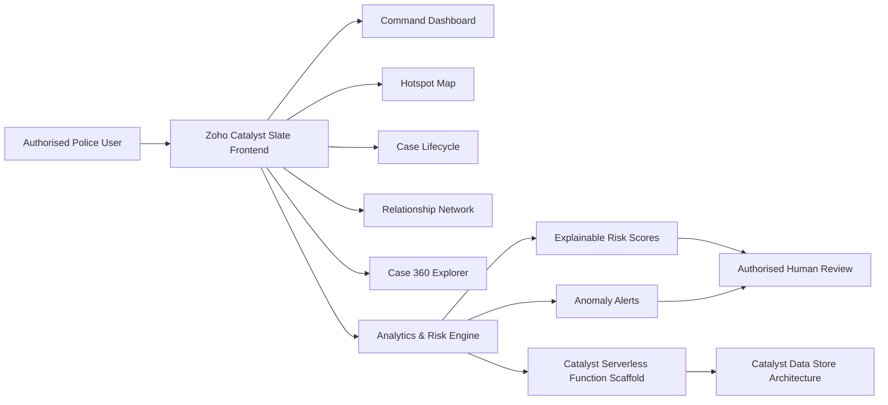

<div align="center">

# 🛡️ KAVACH 360

### AI-Driven Crime Analytics & Visualization Platform  
**KSP Datathon 2026 Prototype**

[](https://kavach360-rgvbqglj.onslate.in/)
[](#)
[](#)
[](#)

**Transforming fragmented FIR records into explainable, location-aware and actionable policing intelligence.**

### [🚀 Open Live Prototype](https://kavach360-rgvbqglj.onslate.in/)

</div>

---

## 📌 Project Overview

**KAVACH 360** is an AI-assisted crime analytics and visualization platform developed for the **AI-Driven Crime Analytics & Visualization Platform** challenge of **KSP Datathon 2026**.

Police FIR information is commonly distributed across interconnected records such as cases, districts, police stations, crime categories, accused persons, arrest events, chargesheets, legal sections and case statuses. Analysing these records through separate tables and reports makes it difficult to quickly identify crime hotspots, delayed investigations, repeat-accused associations and operational workload.

KAVACH 360 converts these fragmented relationships into a unified command center. It provides interactive dashboards, district-level risk indicators, hotspot visualization, case-lifecycle monitoring, relationship networks and a complete Case 360 view.

The prototype is deployed exclusively using **Zoho Catalyst Slate** and uses synthetic and anonymised records based on the supplied FIR database structure. No real citizen or confidential police operational data is included.

---

## 🎯 Problem Statement

Law-enforcement teams need a fast and reliable method to convert complex FIR records into useful operational intelligence.

Existing data-management methods may create difficulties in:

- Identifying emerging crime hotspots
- Monitoring high-risk districts and police stations
- Detecting delayed or unresolved investigations
- Tracking FIR-to-arrest-to-chargesheet progression
- Discovering repeat-accused and co-accused relationships
- Comparing police-station workload
- Understanding the factors behind a risk indicator
- Producing quick operational summaries

KAVACH 360 addresses these challenges through one integrated, visual and explainable analytics platform.

---

## 💡 Proposed Solution

KAVACH 360 combines:

- Crime trend analysis
- Geospatial hotspot visualization
- Explainable operational risk scoring
- Case-lifecycle monitoring
- Repeat-accused relationship analysis
- Police-station workload comparison
- Intent-based operational search
- Unified case intelligence

The platform is designed to support authorised human decision-making. It does not automatically declare a person guilty or recommend enforcement action without human review.

---

## ✨ Core Features

### 1. Crime Intelligence Command Center

The main dashboard displays:

- Total FIR records
- Active and pending cases
- Heinous-offence count
- Arrest rate
- Chargesheet rate
- Average case-disposal time
- FIR trends and forecasting indicators
- District risk ranking
- Operational anomaly alerts

---

### 2. Karnataka Crime Hotspot Map

The interactive hotspot module provides:

- District-level risk visualization
- Crime-volume and risk modes
- High, medium and low-risk indicators
- District selection and drilldown
- Police-station workload details
- Preventive operational recommendations
- Crime-category, gravity and period filters

---

### 3. Explainable Operational Risk Index

KAVACH 360 calculates transparent risk indicators using factors such as:

- Recent crime velocity
- Heinous-offence share
- Unresolved case volume
- Repeat-accused activity
- Historical hotspot patterns

Every risk score is accompanied by its contributing factors, allowing users to understand why an area or case requires attention.

---

### 4. Case Lifecycle Analytics

The platform tracks the progression of an FIR through:

```text
FIR Registration
        ↓
Investigation
        ↓
Arrest / Surrender
        ↓
Chargesheet
        ↓
Final Report / Closure
```

This module highlights:

- Delayed investigations
- Pending cases
- FIR-to-arrest duration
- FIR-to-chargesheet duration
- Case backlog
- SLA exceptions
- District-level turnaround time

---

### 5. Repeat-Accused Relationship Network

The relationship visualization module connects:

- Synthetic accused reference IDs
- Related FIR records
- Co-accused associations
- Repeat appearances
- Associated crime categories
- Multiple-district activity

The module only highlights recorded associations. It does not infer guilt.

---

### 6. Case 360 Explorer

Case 360 presents all essential case information in one place:

- Crime number
- Registration date
- District and police station
- Crime category
- Gravity level
- Current case status
- Incident coordinates
- Applicable legal sections
- Investigating officer reference
- Arrest and chargesheet timeline
- Protected victim information
- Recorded accused associations
- Explainable case-risk score

---

### 7. Ask KAVACH

Ask KAVACH provides an intent-based operational search experience.

Example queries:

```text
Show high-risk districts
Open delayed cases
Robbery in Bengaluru
Show repeat-accused network
```

The system interprets the request and automatically applies the relevant filters or opens the required module.

---

### 8. Exportable Operational Brief

Users can export a structured operational brief containing:

- Applied filters
- Total FIRs
- Pending-case count
- Heinous-offence count
- Arrest rate
- Chargesheet rate
- Priority districts
- Risk indicators
- Data disclaimer

---

## 🧠 System Architecture



---

## 🛠️ Technology Stack

| Layer | Technology |
|---|---|
| Frontend | HTML5, CSS3 and JavaScript |
| Visualizations | SVG and HTML Canvas |
| Hosting | Zoho Catalyst Slate |
| Backend Scaffold | Catalyst Serverless Advanced I/O Function |
| Database Architecture | Catalyst Data Store |
| Version Control | GitHub |
| Data Source | Synthetic and anonymised FIR records |

---

## ☁️ Zoho Catalyst Services

| Catalyst Service | Usage |
|---|---|
| Catalyst Slate | Frontend deployment and public hosting |
| Serverless Functions | Analytics and risk-scoring API scaffold |
| Catalyst Data Store | Proposed relational FIR data storage |
| Authentication | Proposed role-based officer and administrator access |
| API Gateway | Proposed secure API routing |
| SmartBrowz | Proposed operational PDF-report generation |

---

## 🔐 Privacy and Responsible AI

KAVACH 360 follows a privacy-first and human-in-the-loop approach.

- No real citizen data is included
- No confidential FIR records are uploaded
- Names are replaced by synthetic reference IDs
- Victim identities are protected
- Caste and religion are not used for risk scoring
- The platform does not infer guilt
- Every risk score includes contributing factors
- Operational decisions require authorised human review
- Role-based access and audit logs are proposed for production use

---

## 📊 Prototype Dataset

The prototype generates approximately **680 deterministic synthetic FIR records** across multiple Karnataka districts and police stations.

The records contain:

- FIR registration dates
- District details
- Police-station information
- Crime categories
- Gravity classifications
- Case statuses
- Incident coordinates
- Synthetic accused IDs
- Arrest indicators
- Chargesheet indicators
- Legal-section references
- Explainable operational risk factors

> **Data Disclaimer:** All records used in this prototype are fictional, synthetic and anonymised. They are intended only for demonstration and hackathon evaluation.

---

## 📂 Repository Files

```text
KAVACH360/
├── index.html
├── styles.css
├── app.js
├── client-package.json
├── index.js
├── package.json
├── catalyst-config.json
├── catalyst.json
├── datastore_schema.md
├── architecture.svg
├── process_flow.svg
├── prototype_brief.md
├── DEPLOY_CHECKLIST.txt
├── OPEN_KAVACH360.bat
├── NOTICE.md
└── README.md
```

---

## ▶️ Run the Project Locally

### Method 1: Direct Browser Launch

Open:

```text
index.html
```

### Method 2: Windows Launcher

Double-click:

```text
OPEN_KAVACH360.bat
```

### Method 3: Python Local Server

Run the following command inside the project folder:

```bash
python -m http.server 8080
```

Then open:

```text
http://localhost:8080
```

---

## 🚀 Live Deployment

The working prototype has been deployed using **Zoho Catalyst Slate**.

### Live Prototype

```text
https://kavach360-rgvbqglj.onslate.in/
```

[Click here to open KAVACH 360](https://kavach360-rgvbqglj.onslate.in/)

---

## 🎬 Suggested Demo Flow

1. Introduce the problem of fragmented FIR information
2. Show the Command Center KPIs
3. Apply district and crime-category filters
4. Open the Karnataka Hotspot Map
5. Select a high-risk district
6. Explain the operational risk score
7. Open Case Lifecycle Analytics
8. Show delayed-case exceptions
9. Explore the Repeat-Accused Network
10. Open a Case 360 record
11. Enter `robbery in Bengaluru` in Ask KAVACH
12. Export the operational brief
13. Explain privacy and human-review safeguards

---

## 📈 Expected Benefits

KAVACH 360 can help authorised police teams:

- Improve operational situational awareness
- Detect emerging crime hotspots earlier
- Prioritise delayed investigations
- Monitor unresolved case backlogs
- Allocate patrol and investigation resources effectively
- Analyse district and station workload
- Explore recorded case relationships faster
- Reduce manual reporting effort
- Support transparent and evidence-informed decisions
- Provide leadership with a unified operational view

---

## 🔭 Future Development

Future versions can include:

- Integration with authorised live FIR databases
- Catalyst Data Store implementation
- Secure officer and administrator login
- Role-based permissions
- Full audit logging
- Validated Zia AutoML forecasting
- Kannada and English conversational assistance
- Scheduled anomaly monitoring
- Mobile command-center interface
- Encrypted operational reports
- Secure PDF report generation
- Real-time event notifications
- Advanced district and station comparison
- Production-grade data governance

---

## 🏆 Why KAVACH 360 Stands Out

- Strong alignment with the supplied FIR relational structure
- Working and professionally designed prototype
- Exclusive Zoho Catalyst deployment
- Interactive hotspot, lifecycle, network and case analytics
- Explainable risk indicators
- Privacy-aware synthetic dataset
- Human-in-the-loop responsible AI
- Practical district and station-level operational value
- Simple and fast user experience
- Expandable architecture for future production use

---

## 👨‍💻 Developed By

### Tanishk Gupta

**KSP Datathon 2026 Participant**

- GitHub: [tanishkgupta365](https://github.com/tanishkgupta365)
- Repository: [KAVACH360](https://github.com/tanishkgupta365/KAVACH360)
- Live Prototype: [KAVACH 360](https://kavach360-rgvbqglj.onslate.in/)

---

## 📜 Important Notice

The confidential source Police FIR database-design document is not included in this public repository.

This repository contains only:

- Independently developed prototype code
- Simplified database notes
- Synthetic and anonymised records
- Public architecture diagrams
- Deployment documentation

---

<div align="center">

## 🛡️ KAVACH 360

### From fragmented FIR records to actionable and explainable policing intelligence.

**Built for KSP Datathon 2026**

</div>
